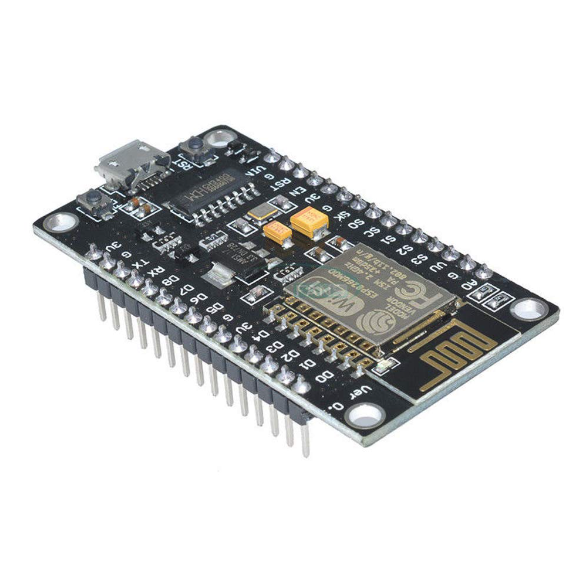
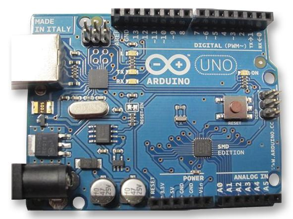
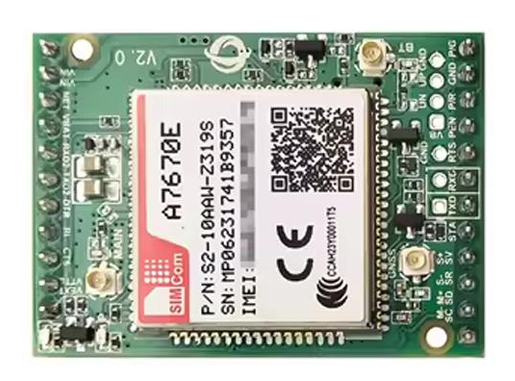
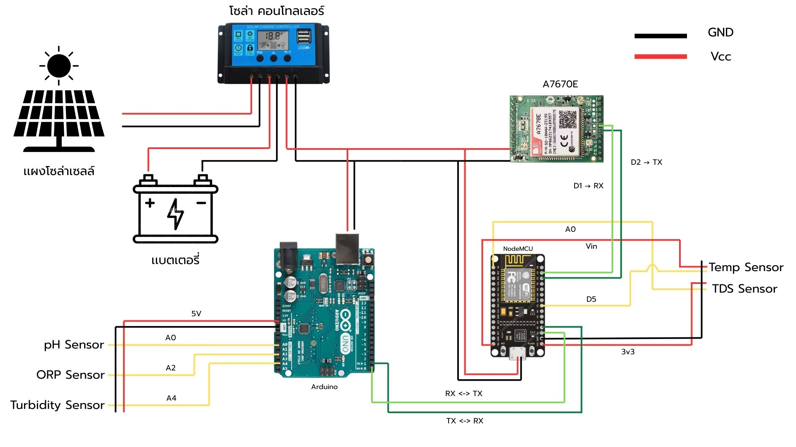

# 🐟 ระบบตรวจวัดคุณภาพน้ำสำหรับบ่อเลี้ยงปลาสลิดด้วยเทคโนโลยี IoT

## 📖 ความเป็นมาของโครงการ
จังหวัดสมุทรสงครามมีพื้นที่เกษตรกรรมคิดเป็นร้อยละ 68.22 ของพื้นที่จังหวัด [cite: 3] [cite_start]โดยมีปลาสลิดเป็นสัตว์เศรษฐกิจที่สร้างรายได้สำคัญให้แก่เกษตรกรในชุมชน [cite: 4] [cite_start]อย่างไรก็ตาม แหล่งน้ำที่ใช้เลี้ยงปลาแต่ละบ่อมีสภาพแตกต่างกัน หากคุณภาพน้ำมีความผิดปกติ เช่น ค่า pH ไม่เหมาะสม หรือมีสารปนเปื้อน จะส่งผลกระทบต่อสุขภาพและอัตราการรอดตายของปลาโดยตรง [cite: 7] [cite_start]การตรวจสอบคุณภาพน้ำในปัจจุบันอาศัยการส่งห้องปฏิบัติการซึ่งใช้เวลานานและมีค่าใช้จ่ายสูง ทำให้ไม่สามารถแก้ไขปัญหาได้ทันที [cite: 8] [cite_start]โครงการนี้จึงพัฒนาระบบตรวจสอบคุณภาพน้ำด้วยเทคโนโลยี IoT เพื่อวัดค่าแบบอัตโนมัติและแจ้งผลแบบเรียลไทม์ ช่วยให้เกษตรกรสามารถดำเนินการแก้ไขได้อย่างรวดเร็วและลดการสูญเสีย [cite: 9]

## 🛠️ อุปกรณ์ฮาร์ดแวร์ที่ใช้

* [cite_start]**NodeMCU V2 ESP8266:** บอร์ดไมโครคอนโทรลเลอร์ที่มี Wi-Fi ในตัว ทำหน้าที่รวบรวมและประมวลผลข้อมูลจากเซ็นเซอร์เพื่อส่งขึ้นระบบคลาวด์ [cite: 43]
  

📸 ดูรูปภาพ

* [cite_start]**Arduino UNO R3:** บอร์ดทำหน้าที่เป็นตัวกลางในการรับค่าจากเซ็นเซอร์แอนะล็อก เพื่อความเสถียรก่อนส่งต่อข้อมูลไปยังหน่วยประมวลผลหลัก [cite: 48]
  

📸 ดูรูปภาพ

* [cite_start]**Sensor วัดอุณหภูมิในน้ำ (DS18B20):** เซ็นเซอร์แบบดิจิทัลสำหรับวัดอุณหภูมิในของเหลว รองรับช่วงการวัดตั้งแต่ -55 ถึง 125 องศาเซลเซียส [cite: 51]
  

📸 ดูรูปภาพ

* [cite_start]**Sensor วัดค่าความขุ่น:** อุปกรณ์ตรวจวัดปริมาณสารแขวนลอยภายในน้ำ สามารถให้สัญญาณเอาต์พุตได้ทั้งแบบแอนะล็อกและดิจิทัล [cite: 54]
  

📸 ดูรูปภาพ

* [cite_start]**Sensor วัดค่า TDS:** เซ็นเซอร์วัดปริมาณของแข็งทั้งหมดที่ละลายอยู่ในน้ำด้วยหลักการนำไฟฟ้า (0-1000 ppm) เพื่อบ่งบอกความบริสุทธิ์ของน้ำ [cite: 57]
  

📸 ดูรูปภาพ

* [cite_start]**Sensor วัดค่า pH:** อุปกรณ์ตรวจสอบความเป็นกรด-ด่างของน้ำ โดยสามารถอ่านค่าได้ในช่วง 0-14 pH ผ่านพอร์ตแอนะล็อก [cite: 60]
  

📸 ดูรูปภาพ

* [cite_start]**Sensor วัดค่า ORP:** เซ็นเซอร์สำหรับวัดศักย์ไฟฟ้าในน้ำ เพื่อตรวจจับความสามารถในการเกิดปฏิกิริยาออกซิเดชันหรือรีดักชันของสารต่าง ๆ [cite: 63]
  

📸 ดูรูปภาพ

* [cite_start]**โมดูลสื่อสารไร้สาย 4G LTE Cat 1 (A7670E):** โมดูลเครือข่ายความเร็วสูงที่ออกแบบมาสำหรับงาน IoT เพื่อใช้ส่งข้อมูลผ่านอินเทอร์เน็ต [cite: 70]
  

📸 ดูรูปภาพ

* [cite_start]**แผงโซล่าเซลล์ (10 วัตต์):** แหล่งกำเนิดพลังงานไฟฟ้าหลักจากแสงอาทิตย์ เพื่อให้ระบบ IoT สามารถทำงานได้อย่างต่อเนื่อง [cite: 38, 73]
  

📸 ดูรูปภาพ

* [cite_start]**เครื่องควบคุมการชาร์จ (PWM):** อุปกรณ์ที่ทำหน้าที่ควบคุมและจัดการพลังงานไฟฟ้าจากแผงโซล่าเซลล์เพื่อกักเก็บลงในแบตเตอรี่ [cite: 75, 118]
  

📸 ดูรูปภาพ

---

## 🔌 การทำงานและการต่อวงจร (Circuit & Data Flow)
[cite_start]ระบบตรวจวัดคุณภาพน้ำมีการแบ่งการทำงานเพื่อความเสถียร โดยบอร์ด Arduino จะเชื่อมต่อและรับค่าจากเซ็นเซอร์ pH, ORP และความขุ่นผ่านขาแอนะล็อก [cite: 122] [cite_start]ในขณะที่บอร์ด NodeMCU จะเชื่อมต่อกับเซ็นเซอร์ TDS และอุณหภูมิโดยตรง [cite: 122] 

[cite_start]บอร์ด Arduino จะทำหน้าที่รวบรวมข้อมูลแล้วส่งต่อไปยังบอร์ด NodeMCU ผ่านการสื่อสารแบบ Serial (TX-RX) [cite: 123] [cite_start]เมื่อ NodeMCU ได้รับข้อมูลครบถ้วน จะประมวลผลความถูกต้องและส่งข้อมูลไปยังเซิร์ฟเวอร์ผ่านโมดูลสื่อสาร 4G (A7670E) [cite: 154] [cite_start]หลังจากส่งข้อมูลเสร็จสิ้น ระบบถูกออกแบบให้เข้าสู่โหมดประหยัดพลังงาน (Sleep Mode) และตัดการเชื่อมต่อชั่วคราว เพื่อให้เหมาะสมกับการใช้พลังงานจากแผงโซล่าเซลล์ [cite: 155]

  
  
<em>ภาพรวมการต่อวงจรของระบบ IoT วัดคุณภาพน้ำ</em>

---

## 📱 การออกแบบส่วนเชื่อมต่อผู้ใช้ (User Interface)
การออกแบบ Interface มุ่งเน้นให้ผู้ใช้งานสามารถติดตามสถานะคุณภาพน้ำได้อย่างรวดเร็วและได้รับการแจ้งเตือนทันทีเมื่อมีความผิดปกติ โดยมีหลักการทำงานดังนี้:
1. [cite_start]**Cloud Connection:** เมื่อระบบ IoT ตรวจวัดค่าคุณภาพน้ำ ข้อมูลจะถูกส่งผ่านเครือข่ายอินเทอร์เน็ตไปเก็บไว้บนแพลตฟอร์ม Blynk (Cloud) [cite: 175]
2. [cite_start]**Database System:** ใช้ Google Apps Script (GAS) ทำหน้าที่เรียกดึงข้อมูลจาก Blynk มาบันทึกลงใน Google Sheet เพื่อใช้เป็นฐานข้อมูลกลาง (Database) [cite: 176, 177]
3. [cite_start]**LINE Official Account:** การสื่อสารกับผู้ใช้งานจะทำผ่านแอปพลิเคชัน LINE โดยใช้ Messaging API เชื่อมต่อกับ Web App (GAS) [cite: 158, 228, 263] [cite_start]ทำให้ผู้ใช้สามารถรับรายงานสถานะน้ำล่าสุด แจ้งเตือนค่าที่สูง/ต่ำกว่าเกณฑ์ และสามารถใช้เมนู (Rich Menu) เพื่อเปิด-ปิดการแจ้งเตือนหรือดูข้อมูลได้อย่างสะดวก [cite: 324, 331, 358, 360]

  
  
<em>โครงสร้างส่วนเชื่อมต่อระหว่าง Cloud, Database และ LINE Application</em>

